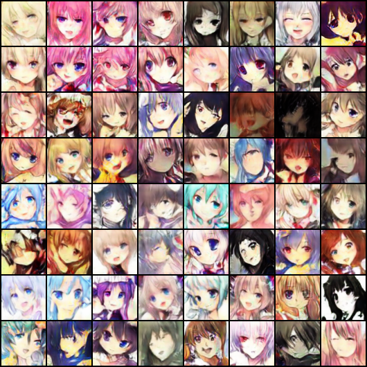

# SAGAN-with-relativistic
A pytorch implmentation of SAGAN (https://arxiv.org/abs/1805.08318) with relativistic loss (https://arxiv.org/abs/1807.00734).
The main difference here is that we replace the hinge loss used in the SAGAN with relativistic loss.

## Sample Results
<p align="center"></p>

## Dependancies
* Python 3.5+
* Pytorch 0.4.1
* Torchvision 0.2.1

## Usage
#### Train 
```bash
python main.py
```

#### View sample results 
```bash
cd images
```

## Acknowledgement/reference
* https://github.com/AlexiaJM/RelativisticGAN
* https://github.com/heykeetae/Self-Attention-GAN
* https://github.com/rosinality/sagan-pytorch
* https://github.com/eriklindernoren/PyTorch-GAN
